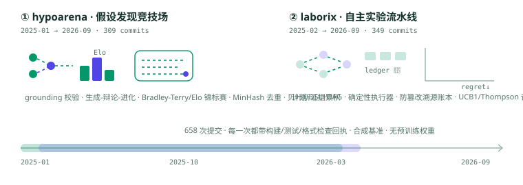

## 旗舰项目

| 项目 | 方向 | 已实现内容 |
|---|---|---|
| [hypoarena](https://github.com/OpSafari/hypoarena) | 假设发现竞技场 | 假设-证据图与 grounding 校验器、植入因果链的合成文献工厂、模型无关的生成-辩论-进化循环（scripted/replay/loopback 适配器）、Bradley-Terry/Elo 锦标赛（对植入技能序的恢复性测试）、MinHash/TF-IDF 去重、贝叶斯证据累积、可复现离线报告 |
| [laborix](https://github.com/OpSafari/laborix) | 自主实验流水线 | 版本化研究计划 DSL 与依赖 DAG、确定性执行器（断点续跑与直跑产物字节一致）、链式哈希防篡改溯源账本、UCB1/Thompson 调度器（对合成 oracle 的实测 regret 曲线）、消融矩阵簿记、离线研究报告合成 |

两个项目都是模型无关的机制实现：默认测试与示例全离线、合成数据带植入真值、不宣称任何真实 LLM 或真实语料成绩。

## 更多开源

除上述两个项目外，这个账号还维护一批 agent 基础设施与实验项目，包括
[mofa](https://github.com/OpSafari/mofa)（模块化、可组合、可编程的 Agent 框架）、
[AIHelms](https://github.com/OpSafari/AIHelms)（企业级 AI 资源纳管平台与统一 AI 网关）、
[openobserve-sre-agent](https://github.com/OpSafari/openobserve-sre-agent)（开源 AI SRE agent）、
[merchantbench](https://github.com/OpSafari/merchantbench)（365 天订单级 LLM agent 长期一致性基准）、
[dsbench](https://github.com/OpSafari/dsbench)（带复杂度基准与可视化的数据结构与算法库）、
[growth-lab](https://github.com/OpSafari/growth-lab)（端到端产品增长工具）、
[LiveStream-Agent-Studio](https://github.com/OpSafari/LiveStream-Agent-Studio)（面向直播电商的本地 AI Agent 工作台）、
[ai-market-maker](https://github.com/OpSafari/ai-market-maker)（AI 加密货币做市）等，完整清单见[仓库列表](https://github.com/OpSafari?tab=repositories)。

## 技术栈

## 活动

<picture>
  <source media="(prefers-color-scheme: dark)" srcset="https://raw.githubusercontent.com/OpSafari/OpSafari/output/github-snake-dark.svg" />
  <source media="(prefers-color-scheme: light)" srcset="https://raw.githubusercontent.com/OpSafari/OpSafari/output/github-snake.svg" />
  
</picture>

## 当前关注

- 假设图谱上的证据累积与矛盾消解，评审 rubric 的可复现语义。
- 实验编排的确定性执行与防篡改溯源：从计划 DAG 到账本哈希链。
- 探索-利用调度在真实研究预算约束下的 regret 行为。
